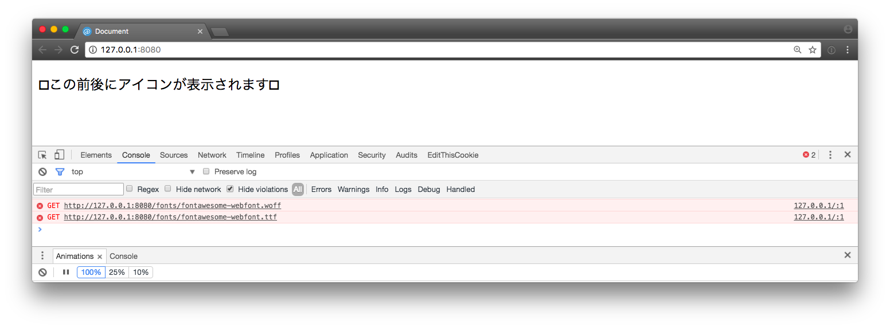
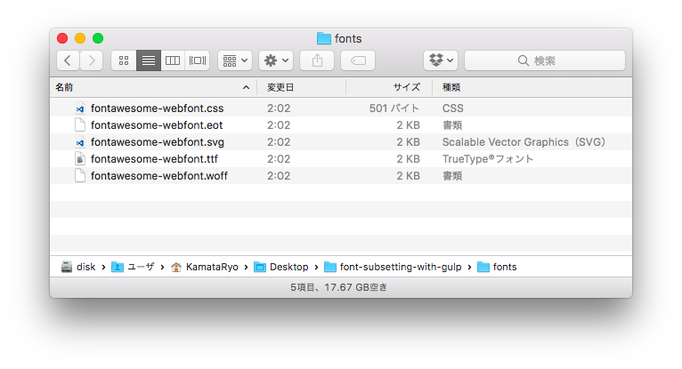

# Gulpを使ってFontAwesomeのサブセットフォントをビルドする
[Gulp](http://gulpjs.com/)を使って[FontAwesome](http://fontawesome.io/)のフォントをサブセット化し、配信ファイルのサイズを縮小する例です。

## 前提

- FontAwesomeのアイコンの指定には、クラスではなくCSS用います
- フォントファイルのソースにはTTF形式のファイルを用います
- 出力形式はEOT、TTF、SVG、WOFFになります。WOFF2には対応していません

## インストール

プロジェクトをNodeパッケージとして初期化し、`FontAwesome`、`Gulp`及び必要なGulpプラグインをインストールします。

```shell
$ npm init
$ npm install -S font-awesome
$ npm install -D gulp gulp-css2txt gulp-fontmin
```

[gulp-css2txt](https://www.npmjs.com/package/gulp-css2txt)はフォントのサブセット化に必要な処理を行うために今回作成した小さなGulpプラグインです。CSSに含まれるcontentプロパティを抽出し、ブラウザに表示されることになる文字を特定します。

[gulp-fontmin](https://www.npmjs.com/package/gulp-fontmin)はフォントのサブセット化を行うためのGulpプラグインです。

## HTMLとCSSの作成

このポストで扱う適当なHTMLファイルとCSSファイルです。FontAwesomeに同梱されているCSSは使いません。`fa-rotate`などを使いたい場合は、LESSなどを使って必要なファイルをインクルードすると良いかもしれません。

```index.html
<!DOCTYPE html>
<html lang="ja">
<head>
  <link rel="stylesheet" href="./style.css">
  <title>Document</title>
</head>
<body>
  <p class="with-icons">この前後にアイコンが表示されます</p>
</body>
</html>
```

```style.css
@font-face {
  font-family: 'FontAwesome';
  src: url('./fonts/fontawesome-webfont.eot');
  src:
    url('./fonts/fontawesome-webfont.eot?#iefix') format('embedded-opentype'),
    url('./fonts/fontawesome-webfont.woff') format('woff'),
    url('./fonts/fontawesome-webfont.ttf') format('truetype'),
    url('./fonts/fontawesome-webfont.svg') format('svg');
}

/* example */
.with-icons::before {
  content: '\f000';
  font-family: 'FontAwesome';
}
.with-icons::after {
  content: '\f001';
  font-family: 'FontAwesome';
}
```

ブラウザでは次のように表示されるはずです。サブセット化したファイルは、`./fonts`以下に置くことにしますが、ビルド前のためアイコンはまだ表示されません。

<!--  -->



## gulpfile.jsの作成

`gulpfile.js`を作成し、フォントをサブセット化するタスクを定義します。[gulp-fontmin](https://www.npmjs.com/package/gulp-fontmin)のオプションについてはそのドキュメントを参照してください。

```gulpfile.js
const gulp    = require('gulp')
const css2txt = require('gulp-css2txt')
const fontmin = require('gulp-fontmin')

gulp.task('subset', cb => {

  const texts = []

  // まずCSSを処理してcontentプロパティの値を集めます
  gulp.src(['./style.css'])
    .pipe(css2txt())
    .on('data', file => texts.push(file.contents.toString()))
    .on('end', () => {

      const text =  texts.join('')
      const format = ['eot', 'ttf', 'woff', 'svg']

      // cssからの文字の抽出が終わったら、これをフォントファイルに適用します
      gulp.src(['./node_modules/font-awesome/fonts/fontawesome-webfont.ttf'])
        .pipe(fontmin({ text, formats }))
        .pipe(gulp.dest('./fonts'))
        .on('end', () => cb())
    })
})
```

## ビルドの実行

ビルドを実行します。実際には、`$ npm run build`に組み込むなどして使うのが良いでしょう。

```shell
$ $(npm bin)/gulp subset

> project@1.0.0 build /path/to/project
> gulp subset

[00:00:00] Using gulpfile /path/to/project/gulpfile.js
[00:00:00] Starting 'subset'...
[00:00:00] gulp-fontmin: Minified 1 font
[00:00:00] Finished 'subset' after 125 ms
```

`./fonts`以下にフォントファイルが配置されてパスが通りました。

ブラウザで `index.html`を読み込むと、以下のように表示されているはずです。

<!--  -->


ファイルサイズも確かに小さくなっています。

サブセット化前

<!--  -->


サブセット化後

<!--  -->



## 注意点

FontAwesomeに同梱されているコアCSS(`./node_modules/font-awesome/css/font-awesome.css`など)の内容を、`gulp-css2txt`に渡さないようにしてください。このファイルでは全てのアイコンクラスと文字コードの対応が定義されているため、サブセット化が働来ません。

## FontAwesomeのライセンスについて

FontAwesomeのフォントは、[OFL-1.1](https://opensource.org/licenses/OFL-1.1)というライセンスで提供されているようです。
カスタマイズしたフォントファイルなどをプロジェクトに同梱する場合は、おそらくCSSなどにライセンスを表示する必要があるでしょう。

## 実装例

GulpでFontAwesomeのフォントをサブセット化する例として、GitHubにリポジトリを作成しています。

https://github.com/KamataRyo/font-subsetting-with-gulp

## まとめ

タスクランナーによるフォントのサブセット化の例として、GulpとFontAwesomeの例を示しました。Gulpのワークフローに組み込む形でフォントファイルを扱えるので、LESSのコンパイルと組み合わせたり、ファイルの変更のwatchして処理を発火させることができます。

## 課題

- `fa fa-glass`などのクラス名で形式で指定されているフォントを特定できない

 > クラス名と文字コードのマップが得られれば可能ですが、FontAwesomeのリポジトリには同梱されたりしていないようです。CSSを解析してマップを得ることもできそうですね。

- contentプロパティがopen-quoteやclose-quoteの時のquoteプロパティの値、リストマークなどのフォントに対応していない

## オプション

HTMLに出現する文字列をピックアップすることで、FontAwesome以外の任意のフォントに対してもサブセット化を行うことができます。以下はその例です。

```gulpfile.js
const gulp        = require('gulp')
const html2txt    = require('gulp-html2txt')
const css2txt     = require('gulp-css2txt')
const streamqueue = require('streamqueue')

// タスクhtmlとcssは省略。EJSやLESSなどによるプリプロセスなどを想定しています

gulp.task('font', ['html', 'css'], cb => {

  const texts = []

  // 複数のストリームをマージする
  streamqueue(
    { objectMode: true },

    // HTMLからテキストノードを抽出
    gulp.src(['./dist/*.html'])
      .pipe(html2txt()),

    // CSSからcontentプロパティの文字を抽出
    gulp.src(['./dist/*.css'])
      .pipe(css2txt())
  )
    // .pipe(hoge()) // 必要ならポスト処理を追加できます
    .on('data', file => texts.push(file.contents.toString()))
    .on('end', () => {

      const text = texts.join('')
      const formats = ['eot', 'ttf', 'woff', 'svg']

      // あとは良いように処理ができます
      Promise.all([
        new Promise((resolve, reject) => {
          // FontAwesomeをサブセット
          gulp.src('./node_modules/font-awesome/fonts/**/*.ttf')
            .pipe(fontmin({ text, formats }))
            .pipe(gulp.dest('./dist/fonts'))
            .on('end', resolve)
            .on('error', reject)
        }),
        new Promise((resolve, reject) => {
          // 好きなフォントをサブセット
          gulp.src('./path/to/pretty/font.ttf')
            .pipe(fontmin({ text, formats }))
            .pipe(gulp.dest('./dist/fonts'))
            .on('end', resolve)
            .on('error', reject)
        })
      ])
        .then(() => cb())
        .catch(err => process.stderr.write(err))
    })
})
```
